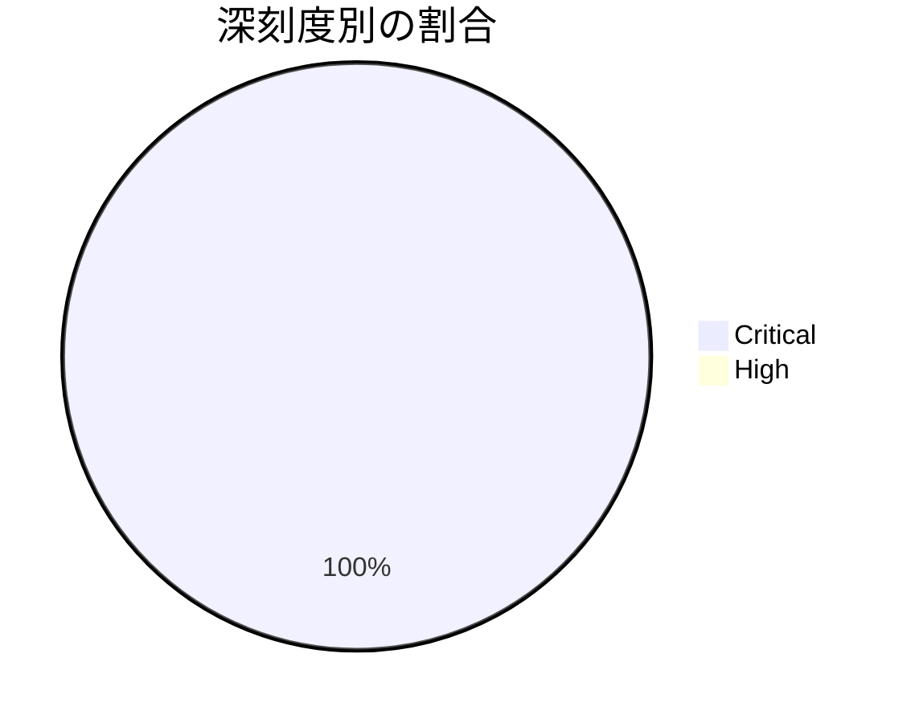

# 全体像
- 総件数と、深刻度別の件数（Critical: 1件 / High: 0件）
- コンポーネント別の件数内訳: Dolby（DD+ Codec）: 1件

# 重要な脆弱性
- CVE-2025-54957（Dolby / DD+ Codec / Critical）: Dolbyコンポーネント（DD+ Codec）における脆弱性。詳細は[Android Security Bulletin—January 2026](https://source.android.com/docs/security/bulletin/2026/2026-01-01)を参照。

# 傾向
- 件数が多いコンポーネント領域を上位順に、件数付きで
  1. Dolby（DD+ Codec領域）: 1件
