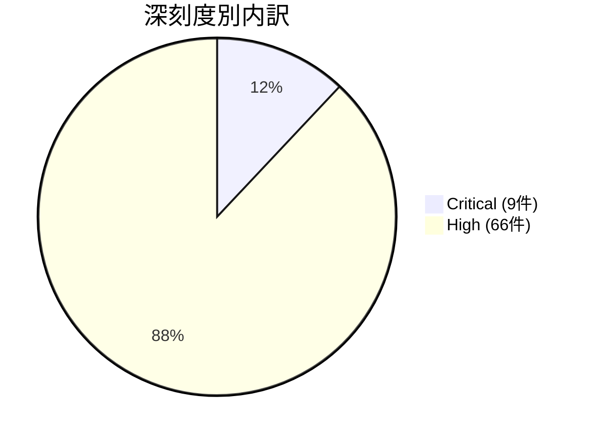

# 全体像
- 総件数: 75件（※正確な内訳の合計）
- 深刻度別の件数: Critical: 9件 / High: 66件
- コンポーネント別の件数内訳（2026-03-01および2026-03-05パッチレベルの合計）:
  - MediaTek components: 21件
  - Framework: 26件
  - System: 19件
  - Kernel (Upstream kernel): 8件
  - Imagination Technologies: 7件
  - Unisoc components: 7件
  - Qualcomm closed-source components: 8件
  - Qualcomm components: 7件
  - Kernel components (pKVM等): 7件
  - Arm components: 1件
  - Misc OEM: 1件
  *(注: 一部のコンポーネントやCVEは複数項目にまたがって集計される場合があります)*

# 重要な脆弱性
- 攻撃の兆候（Exploitation）が確認されている項目:
  - CVE-2026-21385（Qualcomm components / High）: 制限された標的型攻撃において、すでに悪用されている兆候がある旨が報告されています。
- Critical の全件:
  - CVE-2026-0047（Framework / Critical）: 昇格された特権を必要とせず、ローカル特権昇格（EoP）を引き起こす脆弱性。
  - CVE-2026-0006（System / Critical）: 追加の実行特権を必要とせず、リモートコード実行（RCE）を引き起こす脆弱性。
  - CVE-2025-48631（System / Critical）: サービス拒否（DoS）を引き起こす脆弱性。
  - CVE-2024-43859（Kernel / Critical）: Flash-Friendly File System におけるローカル特権昇格（EoP）の脆弱性。
  - CVE-2026-0037（Kernel / Critical）: Protected Kernel-Based Virtual Machine (pKVM) におけるローカル特権昇格（EoP）の脆弱性。
  - CVE-2026-0038（Kernel / Critical）: Hypervisor におけるローカル特権昇格（EoP）の脆弱性。
  - CVE-2026-0027（Kernel components / Critical）: Protected Kernel-Based Virtual Machine (pKVM) におけるローカル特権昇格（EoP）の脆弱性。
  - CVE-2026-0028（Kernel components / Critical）: pKVM におけるローカル特権昇格（EoP）の脆弱性。
  - CVE-2026-0030（Kernel components / Critical）: pKVM におけるローカル特権昇格（EoP）の脆弱性。
  - CVE-2026-0031（Kernel components / Critical）: pKVM におけるローカル特権昇格（EoP）の脆弱性。

# 傾向
件数が多いコンポーネント領域の上位順（上位5領域）:
1. **Framework**: 26件（特権昇格、情報漏洩、サービス拒否など）
2. **MediaTek components**: 21件（主にModemやDisplay、KeyInstall等のコンポーネント領域）
3. **System**: 19件（リモートコード実行や特権昇格など）
4. **Kernel / Kernel components（上流およびpKVM等含む）**: 15件
5. **Qualcomm closed-source / Qualcomm components**: 15件（クローズドソースおよびDisplayやKernel等）
