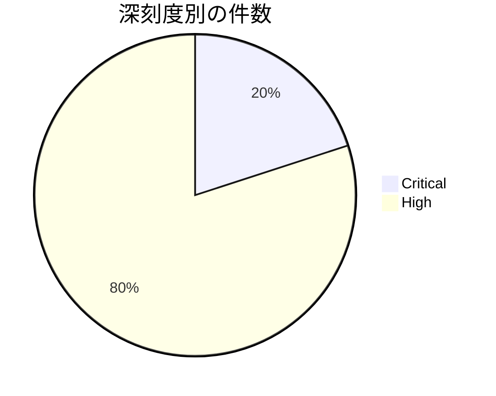

# 全体像
- 総件数: 5件
- 深刻度別の件数: Critical: 1件 / High: 4件
- コンポーネント別の件数内訳:
  - Framework: 1件
  - Google: 1件
  - NXP components: 1件
  - STMicroelectronics: 1件
  - Thales: 1件

# 重要な脆弱性
- [CVE-2026-0049](https://source.android.com/docs/security/bulletin/2026/2026-04-01) (Framework / Critical): ローカルのサービス拒否（DoS）を引き起こす脆弱性（追加の実行権限やユーザー操作は不要）

# 傾向
- コンポーネント領域ごとの件数上位順（同率）：
  - Framework: 1件
  - Google: 1件
  - NXP components: 1件
  - STMicroelectronics: 1件
  - Thales: 1件
