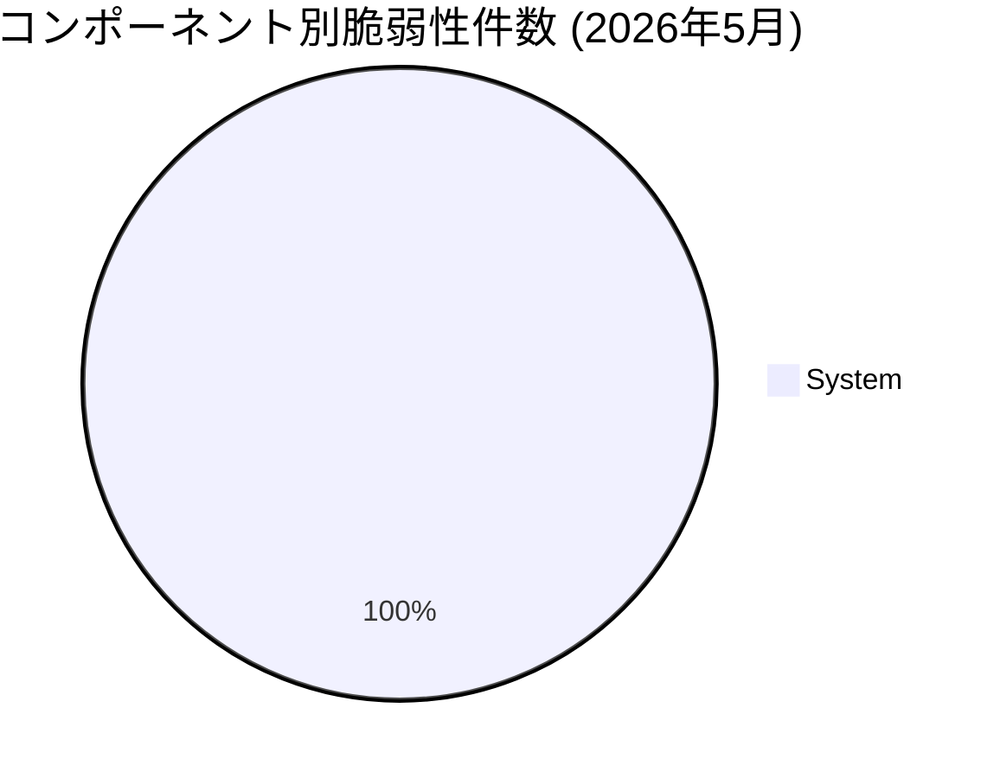

# 全体像
- 総件数: 1件
- 深刻度別の件数: Critical: 1件 / High: 0件
- コンポーネント別の件数内訳:
  - System: 1件

# 重要な脆弱性
- CVE-2026-0073（[System](https://source.android.com/docs/security/bulletin/2026/2026-05-01#system) / Critical）: 追加の実行権限を必要とせず、シェルユーザーとしてのリモート（近接/隣接）コード実行（RCE）につながる脆弱性。悪用にユーザー操作は不要。

# 傾向
- 件数が多いコンポーネント領域（上位順・件数付き）:
  - System: 1件

> **詳細:** 各脆弱性の詳細な情報や対応するAOSPの変更リストについては、[Android Security Bulletin—May 2026](https://source.android.com/docs/security/bulletin/2026/2026-05-01)を参照してください。
