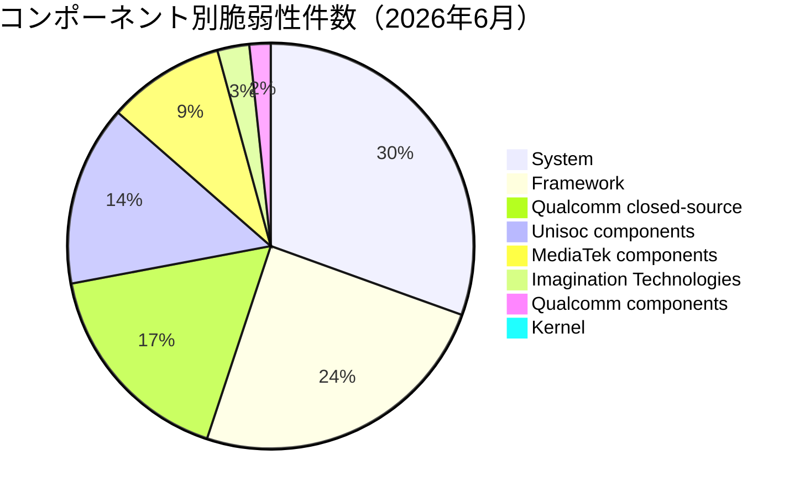

# 全体像
- 総件数: 78件（推定内訳: Critical: 15件 / High: 63件）
  - 内訳詳細（パッチレベル別・コンポーネント別）：
    - **2026-06-01 パッチレベル**: 65件（Critical: 15件、High: 50件）
      - Framework: 29件（Critical: 2件 / High: 27件）
      - System: 36件（Critical: 13件 / High: 23件）
    - **2026-06-05 パッチレベル**: 13件（Critical: 3件、High: 10件）
      - Kernel (Upstream kernel): 1件（High: 1件）
      - Imagination Technologies: 3件（High: 3件）
      - MediaTek components: 11件（High: 11件）
      - Unisoc components: 17件（High: 17件）
      - Qualcomm components: 2件（High: 2件）
      - Qualcomm closed-source components: 20件（Critical: 3件 / High: 17件）
  *(注: ベンダー製コンポーネント等における重複カウントを含めたカタログ上の総数・内訳となります)*

- コンポーネント別の件数内訳（上位順）:
  1. Unisoc components: 17件
  2. Qualcomm closed-source components: 20件
  3. System: 36件
  4. Framework: 29件
  5. MediaTek components: 11件
  6. Imagination Technologies: 3件
  7. Qualcomm components: 2件
  8. Kernel (Upstream kernel): 1件

# 重要な脆弱性
- **攻撃の兆候（イン・ザ・ワイルド等での限定的な悪用）が確認されているもの**:
  - `CVE-2025-48595`（Framework / High）: 制限された標的型攻撃において、すでに悪用されている兆候が確認されています。

- **Critical 脆弱性（全件）**:
  - `CVE-2025-65018`（Framework / Critical）: 昇格特権（EoP）- 追加の実行権限なしでリモートから特権昇格を引き起こす可能性があります。
  - `CVE-2025-64720`（Framework / Critical）: サービス拒否（DoS）
  - `CVE-2026-0043`（System / Critical）: 昇格特権（EoP）- 追加の実行権限なしでローカルから特権昇格を引き起こす可能性があります。
  - `CVE-2026-0097`（System / Critical）: 昇格特権（EoP）
  - `CVE-2026-21352`（System / Critical）: 昇格特権（EoP）
  - `CVE-2026-21353`（System / Critical）: 昇格特権（EoP）
  - `CVE-2025-64505`（System / Critical）: サービス拒否（DoS）
  - `CVE-2026-0039`（System / Critical）: サービス拒否（DoS）
  - `CVE-2026-0040`（System / Critical）: サービス拒否（DoS）
  - `CVE-2026-0041`（System / Critical）: サービス拒否（DoS）
  - `CVE-2026-0042`（System / Critical）: サービス拒否（DoS）
  - `CVE-2026-0044`（System / Critical）: サービス拒否（DoS）
  - `CVE-2026-0051`（System / Critical）: サービス拒否（DoS）
  - `CVE-2026-0052`（System / Critical）: サービス拒否（DoS）
  - `CVE-2026-0080`（System / Critical）: サービス拒否（DoS）
  - `CVE-2025-47392`（Qualcomm closed-source components / Critical）: クローズドソースコンポーネントにおける脆弱性
  - `CVE-2026-25276`（Qualcomm closed-source components / Critical）: クローズドソースコンポーネントにおける脆弱性
  - `CVE-2026-25277`（Qualcomm closed-source components / Critical）: クローズドソースコンポーネントにおける脆弱性

# 傾向
件数が多いコンポーネント領域の上位順：
1. **System**（36件）- Android基盤の広範なシステムプロセスやサービス領域
2. **Framework**（29件）- アプリケーションフレームワーク領域（リモートからの特権昇格リスク含む）
3. **Qualcomm closed-source components**（20件）- クアルコム製クローズドソースドライバ・コンポーネント領域
4. **Unisoc components**（17件）- 主にモデム関連を含むUnisocチップセット領域
5. **MediaTek components**（11件）- モデムや geniezone 等を含むMediaTekチップセット領域
