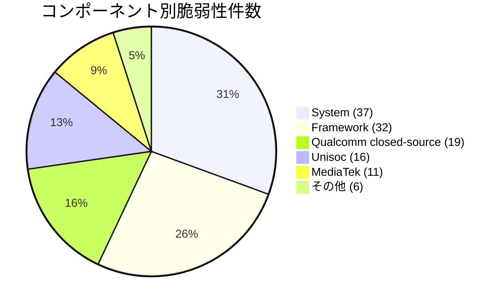

# 全体像
- **総件数**: 121件（Critical: 18件 / High: 103件）
- **コンポーネント別内訳**:
  - **System**: 37件（Critical: 13件 / High: 24件）
  - **Framework**: 32件（Critical: 2件 / High: 30件）
  - **Qualcomm closed-source components**: 19件（Critical: 3件 / High: 16件）
  - **Unisoc components**: 16件（High: 16件）
  - **MediaTek components**: 11件（High: 11件）
  - **Imagination Technologies**: 3件（High: 3件）
  - **Qualcomm components**: 2件（High: 2件）
  - **Kernel**: 1件（High: 1件）

# 重要な脆弱性
※Critical（全18件）および悪用の兆候が報告されている脆弱性（1件）。

### 攻撃の兆候（悪用）が確認されている脆弱性
- **CVE-2025-48595**（Framework / High）: 限定的かつ標的型の攻撃（targeted exploitation）の兆候が報告されている権限昇格（EoP）の脆弱性。詳細: [Android Security Bulletin 2026-06-01](https://source.android.com/docs/security/bulletin/2026/2026-06-01)

### Critical（重大）な脆弱性
- **CVE-2025-65018**（Framework / Critical）: 追加の実行権限やユーザー対話なしでリモートから権限昇格（EoP）が可能な脆弱性。
- **CVE-2025-64720**（Framework / Critical）: サービス運用妨害（DoS）につながる脆弱性。
- **CVE-2026-0043**（System / Critical）: 追加の実行権限なしでローカルから権限昇格（EoP）が可能な脆弱性。
- **CVE-2026-0097**（System / Critical）: ローカル権限昇格（EoP）の脆弱性。
- **CVE-2026-21352**（System / Critical）: ローカル権限昇格（EoP）の脆弱性。
- **CVE-2026-21353**（System / Critical）: ローカル権限昇格（EoP）の脆弱性。
- **CVE-2025-64505**（System / Critical）: サービス運用妨害（DoS）につながる脆弱性。
- **CVE-2026-0039**（System / Critical）: サービス運用妨害（DoS）につながる脆弱性。
- **CVE-2026-0040**（System / Critical）: サービス運用妨害（DoS）につながる脆弱性。
- **CVE-2026-0041**（System / Critical）: サービス運用妨害（DoS）につながる脆弱性。
- **CVE-2026-0042**（System / Critical）: サービス運用妨害（DoS）につながる脆弱性。
- **CVE-2026-0044**（System / Critical）: サービス運用妨害（DoS）につながる脆弱性。
- **CVE-2026-0051**（System / Critical）: サービス運用妨害（DoS）につながる脆弱性。
- **CVE-2026-0052**（System / Critical）: サービス運用妨害（DoS）につながる脆弱性。
- **CVE-2026-0080**（System / Critical）: サービス運用妨害（DoS）につながる脆弱性。
- **CVE-2025-47392**（Qualcomm closed-source components / Critical）: Qualcommのクローズドソースコンポーネントにおける重大な脆弱性。
- **CVE-2026-25276**（Qualcomm closed-source components / Critical）: Qualcommのクローズドソースコンポーネントにおける重大な脆弱性。
- **CVE-2026-25277**（Qualcomm closed-source components / Critical）: Qualcommのクローズドソースコンポーネントにおける重大な脆弱性。

# 傾向
件数が多いコンポーネント領域の上位は以下の通りです。

1. **System**（37件）: DoS（サービス運用妨害）および権限昇格（EoP）のCritical脆弱性が多数集中しています。
2. **Framework**（32件）: リモート権限昇格（CVE-2025-65018）や、限定的な標的型攻撃の兆候があるCVE-2025-48595を含みます。
3. **Qualcomm closed-source components**（19件）: 3件のCriticalを含むチップセット固有の脆弱性。
4. **Unisoc components**（16件）: 主にモデムサブコンポーネントに集中。
5. **MediaTek components**（11件）: モデムやgeniezoneサブコンポーネントを中心とした脆弱性。
