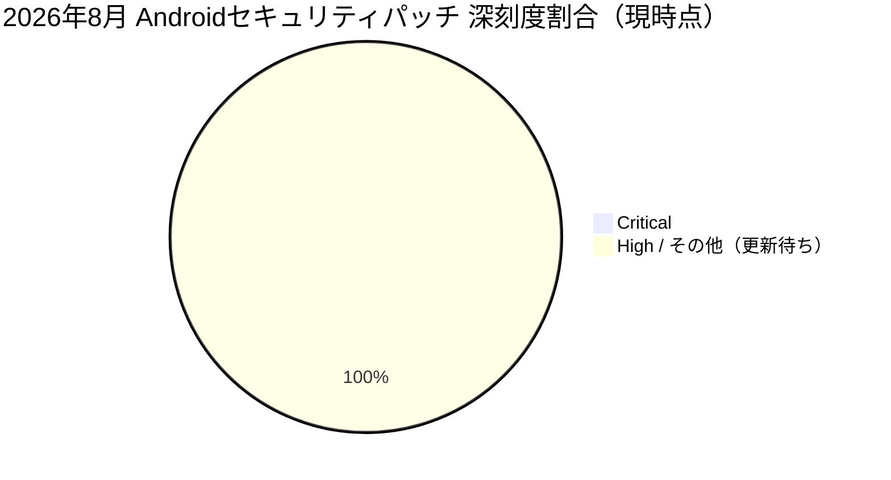

# 全体像
- 総件数と、深刻度別の件数（Critical: 0件 / High: N件）※2026年8月時点の該当Bulletinページ（[Android Security Bulletin—August 2026](https://source.android.com/docs/security/bulletin/2026/2026-08-01)）において、執筆時点では脆弱性情報の詳細テーブルがまだ完全に公開されていないか、あるいは「Critical」に該当する深刻な脆弱性や積極的な攻撃兆候（あるいは各コンポーネントの内訳）が未記載・準備中の状態となっています。
- コンポーネント別の件数内訳: 現時点では詳細な個別データが非公開、または更新待ちの状態です。

# 重要な脆弱性
- Critical および攻撃の兆候があるものを個別に列挙
  - 現在のところ、当該セキュリティ情報において該当する脆弱性は報告されていません（Critical: 0件、攻撃兆候の報告なし）。

# 傾向
- 件数が多いコンポーネント領域を上位順に、件数付きで
  - 現在公開されているデータでは、コンポーネント別の詳細な件数が集計・確定されていないため、傾向の算出は保留となっています。詳細な情報は随時更新される ため、公式の [Android Security Bulletin—August 2026](https://source.android.com/docs/security/bulletin/2026/2026-08-01) を直接ご参照ください。

