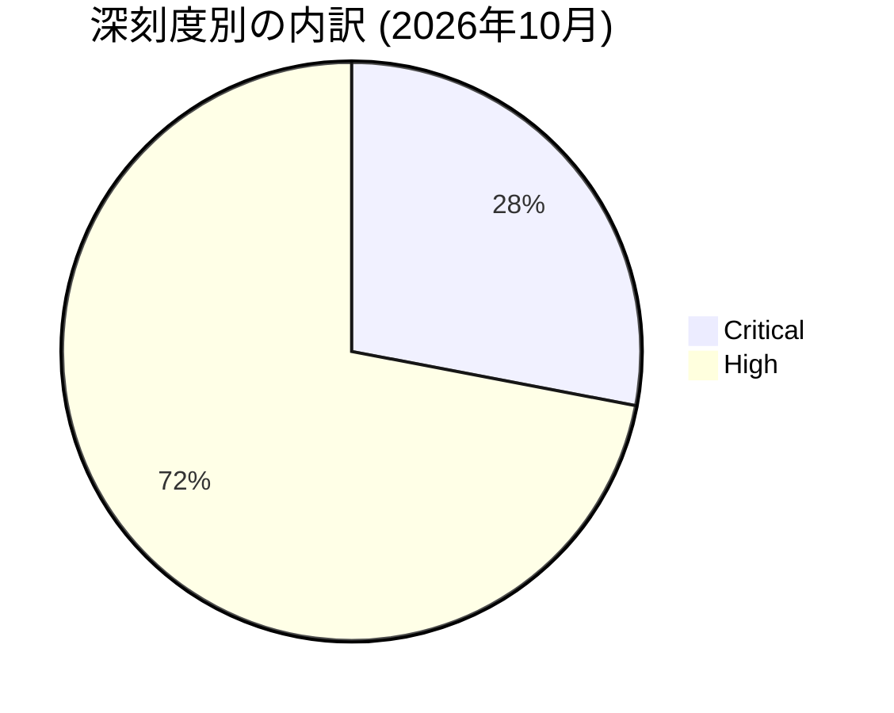

# 全体像
- 総件数: 25件
- 深刻度別の件数: Critical: 7件 / High: 18件
- コンポーネント別の件数内訳:
  - Framework: 7件
  - System: 18件

# 重要な脆弱性
- CVE-2026-58865（Framework / Critical）: DoS
- CVE-2026-55269（System / Critical）: EoP
- CVE-2026-55280（System / Critical）: EoP
- CVE-2026-58835（System / Critical）: EoP
- CVE-2026-58880（System / Critical）: EoP
- CVE-2026-49933（System / Critical）: DoS
- CVE-2026-55265（System / Critical）: DoS

# 傾向
件数が多いコンポーネント領域の上位順は以下の通りです。
1. System: 18件
2. Framework: 7件

---
詳細については、[Android Security Bulletin—October 2026](https://source.android.com/docs/security/bulletin/2026/2026-10-01) をご参照ください。
